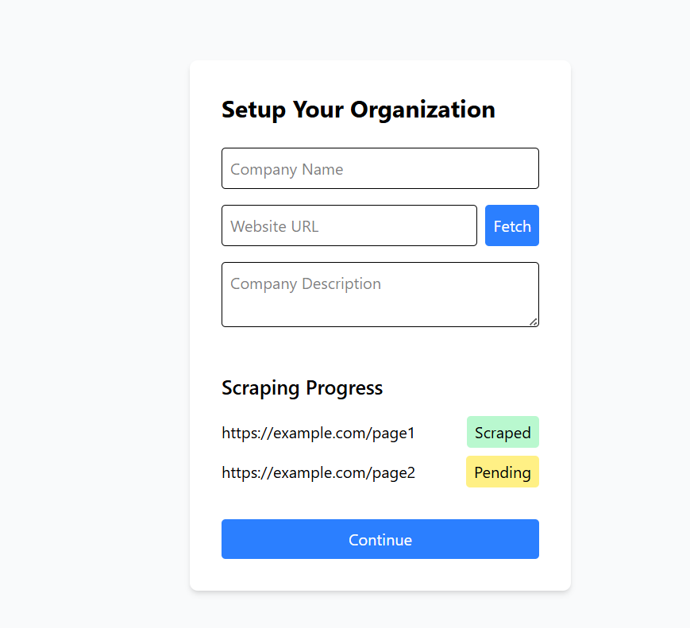
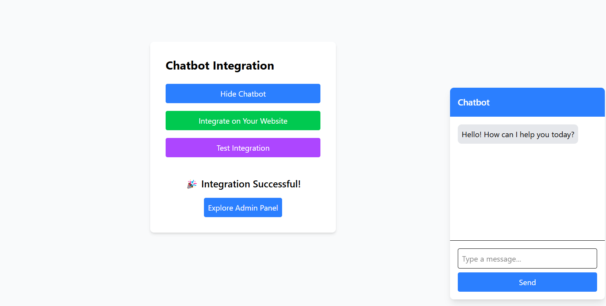

# BeyondChats Chatbot Setup UI

This project is a UI/UX implementation of the chatbot setup workflow for BeyondChats. It includes three main sections:
1. **User Registration**
2. **Setup Organisation**
3. **Chatbot Integration & Testing**

## Live Demo
[View Live Demo]((https://chat-bot-ass.vercel.app/))

## Features
- Mobile-responsive design.
- Smooth transitions and animations.
- Dummy data for scraping progress and chatbot integration.
- Success UI with confetti animation.

## Technologies Used
- ReactJS
- Tailwind CSS
- Vite
- Framer Motion (for animations)

## How to Run Locally
1. Clone the repository:
   ```bash
   git clone https://github.com/kanchan0508/chat-bot.git

   Install dependencies:

2. npm install
Start the development server:

3. npm run dev
Open the app in your browser at http://localhost:5173.

## Screenshots






### **Final Notes**

Focus on delivering a **polished, mobile-responsive UI/UX** within the given timeframe. If you have any questions or need further clarification, feel free to ask. Good luck with your assignment! 🚀
